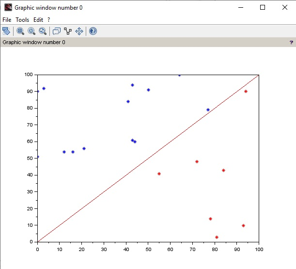

# scilab 
Scilab es un software para análisis numérico, con un lenguaje de programación de alto nivel para cálculo científico. Es desarrollado por Scilab Enterprises, bajo la licencia CeCILL, compatible con la GNU General Public License.

Las características de Scilab incluyen análisis numérico, visualización 2-D y 3-D, optimización, análisis estadístico, diseño y análisis de sistemas dinámicos, procesamiento de señales, e interfaces con Fortran, Java, C y C++. 

## instalación
Descargue el software desde [sitio oficial scilab](https://www.scilab.org).

## introducción
### trazar una línea
recuerde que la ecuacion de la recta la podemos ver como: 

**y=w1*x1+w0**

Tracemos una recta en scilab:

```scilab
x=linspace(0, 100, 100);
w0=3;
w1=0.5;
for i=1:100
    y(i)=w1*x(i)+w0;
end
plot(x,y,'r');
```

Explicacuón:

`linespace(x1,x2,n)` devuelve un arreglo de n puntos equidistantes entre los valores x1 y x2.

Con `x=linespace(0,100,100)`, obtenemos un arreglo de 100 puntos entre 0 y 100, que representaran los puntos del eje X de la recta.

Con el for creamos los valores `Y` de la recta, en Scilab las variables se crean de manera dinámica, de tal forma que en el primer ciclo del for se esta creando el arreglo `y`, con el primer valor `y(1)`, y en cada iteración se aumenta su tamaño con un nuevo elemento `y(i)`.

Finalmente `plot(x,y,'r')` traza una recta en 2D en color rojo para los valores x,y, donde x,y son los arreglos con las coordenadas x,y.

## Archivo de trabajo para reconocimiento de patrones 
### caso linealmente separable
Crearemos un archivo de trabajo con puntos en 2D con una distribusión como esta:


Grafica 1 20 puntos clasificados.

La idea es tener un conjunto de puntos linealmente seprables donde los puntos por encima de la línea pertenecen a la clase 1 y los puntos por debajo pertenecen a la clase -1.

Este conjunto de puntos lo guardaremos en un archivo para nuestras pruebas de algoritmos de clasificación.

Para este ejercicio, crearemos 20 puntos aleatorios y los dividiremos en 2 clases.

Código:

```scilab
//crea archivo de trabajo
//seran 20 puntos
np=20;
//creamos los 20 puntos aleatorios de 0 a 100 en 2D
x=round(rand(2,np,'uniform')*100);
x1=x(1,:);//Arreglo x1 con las coordenadas x
y1=x(2,:);//Arreglo y1 con las coordenadas y

//Trazamos una linea en y-x=0 o sea f(x)=x o sea
//y=x o sea 0=x-y
//valores de las clases en F
F=[1;-1];

//generamos los valores x,y de la recta
x2=linspace(0,100,100);
for i=1:100
    y2(i)=x2(i);
end
//trazamos la recta
plot(x2,y2,'r');


//Clasificamos los puntos a la izq o der de la linea
for i=1:np
    l(i)=F(2)*y1(i)+F(1)*x1(i);
    class_F(i)=sign(l(i));
end
//mostramos los puntos con difernte color segun su clase
for i=1:np
    if(class_F(i)==1)
        plot(x1(i),y1(i),'r*')
     else
         plot(x1(i),y1(i),'b*')
    end
end
//escribimos los puntos al archivo de trabajo
M=[x1',y1',class_F];
write('datos1.txt',M);

```

### explicacion del código

primero crearemos 20 puntos aleatorios
```scilab
//creamos una matriz (2*20)
x=round(rand(2,np,'uniform')*100);
//El primer renglon de la matriz será la coordenadas x
x1=x(1,:);//Arreglo x1 con las coordenadas x
//el segundo renglon de la matriz será la coordenadas y
y1=x(2,:);//Arreglo y1 con las coordenadas y
```
`rand(2,np,'uniform')` crea un conjunto de 20 valores aleatorios entre 0 y 1, distribuidos uniformemente, los multiplicamos por 100 para que de valores entre 0 y 100, por ejemplo un si un valor aleatorio generado en 0.2345 al multplicar * 100 dara 23.45, el 23 es el que nos interesa. Finalmente la función round elimina los decimales y deja solo el 23.

La matriz v creada tiene 20 datos de la forma:
|x|y|
|----|----|
|56.0|83.0|
|32.0|15.0|
|11.0| 5.0|
|34.0|45.0|
...

con la sentencia `x1=x(1,:);` creamos el vector x que cotiene todos los valores de la columna 1 de la matriz.


Tracemos una líea que pase por enmedio del área donde estan los puntos:

```scilab
x2=linspace(0,100,100);
for i=1:100
    y2(i)=x2(i);
end
plot(x2,y2,'r');
``` 

Para clasificar, note que todo punto por debajo de la linea, tienen una coordenada **x** mayor que su coordenada **y** (x>y), a su vez todo punto por encima de la linea tiene una coordenada (y>x).

Si hacemos una resta de `x-y` y obtenemos el signo del resultado de la resta (la funcion signo es una funcion de scilab que da 1 si el argumento es positivo y -1 si es negativo), con eso podemos asignar una clase u otra a cada punto, los puntos por encima de la linea serán de clase 1 y los puntos por debajo serán de clase -1.

```scilab
//Clasificamos los puntos a arriba o abajo de la linea
//restando el y del punto menos el y de la recta
for i=1:np
    l(i)=F(2)*y1(i)+F(1)*x1(i);
    class_F(i)=sign(l(i));
end
```
Creamos un arreglo F con la clase de cada punto.


Finalmente graficamos los puntos segun su clase y los guardamos en un archivo:
```scilab
for i=1:np
    if(class_F(i)==1)
        plot(x1(i),y1(i),'r*')
     else
         plot(x1(i),y1(i),'b*')
    end
end

M=[x1',y1',class_F];
write('datos1.txt',M);

```
## Clasificacion de puntos percepron simple

Tomaremos un conjunto de 20 puntos preclasificados como en la gráfica 1 donde se muestra la clasificacion actual con solores diferentes, el perceptron toma esos valores y busca una recta que clasifique los puntos.
La recta encontrada por el perceptron la muestra en verde.
Si la recta divide bien los puntos, el perceprron funciona bien.

```scilab
//Jesus Alejandro Flores Hernandez 
//codigo en SCILAB
//Ejemplode perceptron simple
//Probado y revisado 22-sep 2023
//Genera unn conjunto de numeros dentro de los limites del cuadro
//(-1,1),(1,1),(1,-1),(-1,-1)
//Traza una recta y-2x=0
//Clasifica los puntos segun la recta (este sera el conjunto de trabajo)
//a continuacion aplica el algoritmo de perceptron

////////////// Genera el conjunto de trabajo /////////////
nct=20; //tamaño del conjunto de trabajo
x=2*rand(2,nct)-1;
x1=x(1,:);//Arreglo x1 contiene coordenadas x
y1=x(2,:);//Arreglo y1 contiene coordenadas y
plot(x1,y1,'*');

//Graficamos una linea arbitraria y=2x
//calculamos el y de la linea
x2=linspace(-1,1,100);
for i=1:100
    y2(i)=2*x2(i);
end
//mostramos área de trabajo para fines visuales solamente
//plot(x2,y2,'r') //trazamos una línea roja


//Clasificamos los puntos arriba y abajo de la linea
//los puntos a comparar tienen la misma x que la recta
//solo hay que calcular la y de la recta
//y la y del punto y restar,
//para el conjunto de puntos:
//la y de la recta es 2x y la y del punto es y1
//clasificamos segun el resultado
for i=1:nct
    l(i)=2*x1(i)-y1(i); //y del punt
    class_F(i)=sign(l(i));  
end

//mostramos los puntos clasificados
for i=1:nct
        if class_F(i)==1 then
            plot(x1(i),y1(i),'gre*');
        else
            plot(x1(i),y1(i),'blu*');    
        end
end
///// fin de generacion de conjunto de trabajo ////

//////Algoritmo de perceptron /////////////////////
///////////////////////////////////////////////////
//la función hipotesis es la ecuacion de la recta
//g(x,y)=w1*x+w2*y 
//los pesos iniciales son w1=0 and w2=0
//w=[0;0];
//Calculamos la salida del perceptron con los pesos
//actuales para todos los puntos g(x)=w1*x1+w2*y1
for i=1:nct
    g(i)=sign(w(2)*y1(i)+w(1)*x1(i));
end
//en g(i) quedan los puntos clasificados 
//segun los datos iniciales del perceptron

//~= operador relacional es distinto que
//buscamos las salidas que no concuerdan con nuestra
//clasificación, este operador,
//en el arreglo ind pone los indices 
//donde loa arreglos g y class_F son diferentes
ind = find(g ~= class_F);
//es decir en ind tenemos los idices donde la clasificacion
//que tenemos no coincide con la clasificacion del preceptron

iter=1;
while ~isempty(ind) //si es vacio => fin
    //si no esta vacio entonces hay valores erroneos 
    //en el percpetron
    //operador .* es multiplicación de matrices 
    //elemento a elemento
    //actualizamos los pesos
    w(1) = w(1) + (class_F(ind(1))-g(ind(1))).*x1(ind(1));  // 
    w(2) = w(2) + (class_F(ind(1))-g(ind(1))).*y1(ind(1));  // 
    //calculamos la nueva salida del perceptron
    for i=1:nct
         temp(i)=sign(w(2)*y1(i)+w(1)*x1(i));
    end
    //buscamos donde esta mal la estimacion del perceptron
    ind = find(temp ~= class_F);
    iter = iter + 1;
    g=temp;
end
//recta resultante 
//=w(1)*xr+w2*yr
//yr=(-w(1)*xr)/w2)
//la recta calculada por el perceptron la muestra en verde
xr=linspace(-1,1,100);
for i=1:100
    yr(i)=(-w(1)*xr(i))/w(2);
end
plot(xr,yr,'g')

```

Referencias:

[linespace en scilab](https://help.scilab.org/linspace)